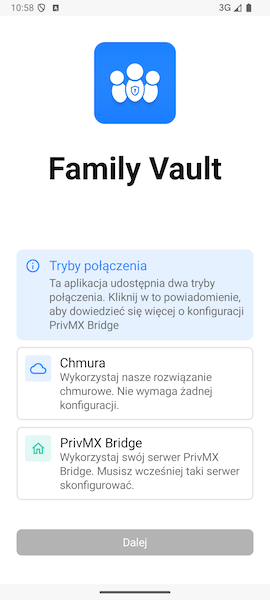
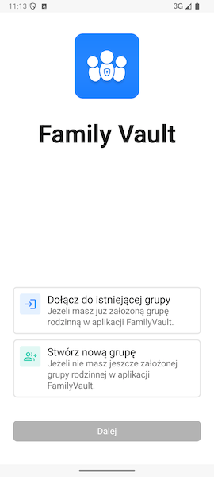
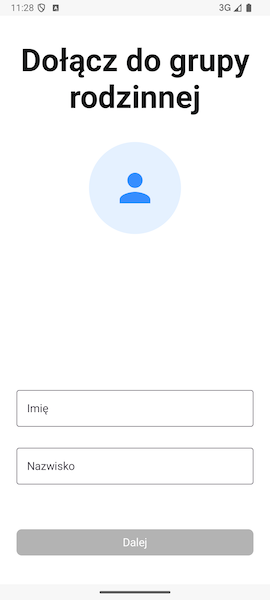

# Dołączanie do grupy rodzinnej 

Ta sekcja wytłumaczy Twoje pierwsze kroki w FamilyVault, czyli jak dołączyć do grupy rodzinnej.

## Wybór sposobu połączenia z serwerem

Po uruchomieniu aplikacji po raz pierwszy przywita Cię ekran wyboru sposobu połączenia z serwerem.

Jeśli nie masz wiedzy technicznej wybierz **rozwiązanie chmurowe** - nie wymaga ono żadnej konfiguracji nadal oferując pełne bezpieczeństwo Twoich danych.

Jeżeli posiadasz wiedzę techniczną i chciałbyś skorzystać z własnego serwera, musisz takowy najpierw przygotować. Szczegółowe instrukcje na ten temat znajdziesz *tutaj*. Po przygotowaniu konfiguracji wybierz opcję **PrivMX Bridge**.

Po zaznaczeniu odpowiedniej opcji kliknij przycisk **Dalej** znajdujący się u dołu ekranu.

## Dołącz do grupy rodzinnej

Po zaakceptowaniu wstępnych ekranów powitalnych aplikacja poprosi Cię o określenie, czy chcesz dołączyć do istniejącej grupy rodzinnej, czy utworzyć nową.

W tej części dokumentacji skupiamy się na opcji **dołączania do grupy rodzinnej**. 

Po dokonaniu wyboru naciśnij przycisk **Dalej**, aby kontynuować konfigurację.

## Dołącz do istniejącej grupy

Po wybraniu opcji **Dołącz do istniejącej grupy** zobaczysz pierwszą część formularza, dzięki któremu dołączysz do grupy rodzinną.

Wpisz tutaj swoje imię lub nazwę użytkownika, opcjonalnie możesz również dodać swoje nazwisko.
W razie jakichkolwiek niepoprawnych danych informacja o tym co poszło nie tak znajdzie się pod polem, którego błąd dotyczy.

Po wypełnieniu wszystkich informacji naciśnij **Dalej**.

## Ustawianie hasła klucza prywatnego

Następny ekran poprosi Cię o podanie hasła zabezpieczającego Twój **klucz prywatny** w aplikacji FamilyVault.

### Dlaczego ustawienie silnego hasła do klucza prywatnego jest ważne?

**Klucz prywatny** to element, który służy do szyfrowania i odszyfrowywania Twoich danych rodzinnych (np. zdjęć, dokumentów, wiadomości). Hasło, które tu ustawiasz, **nigdy nie jest wysyłane na serwer** — pozostaje wyłącznie na Twoim urządzeniu.

> 🔒 **Ważne:** Nie zapomnij tego hasła! Nie będziemy w stanie go odzyskać. Jeśli je stracisz, dostęp do zaszyfrowanych danych będzie niemożliwy.

Zalecamy użycie:
- Minimum 8 znaków,
- Małych i wielkich liter,
- Cyfr oraz znaków specjalnych.

Po dwukrotnym wpisaniu hasła naciśnij **Dalej**.

## Dołączanie do grupy rodzinnej - NFC i kod QR

