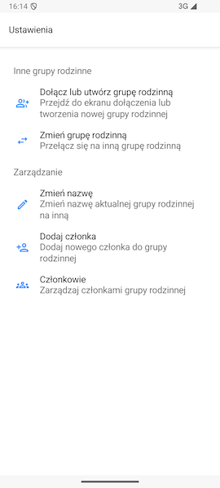

# Ekran ustawień aplikacji

Aby dostać się do ekranu ustawień aplikacji, wystarczy nacisnąć ikonę **koła zębatego**, znajdującą się w prawym górnym rogu na ekranie głównym aplikacji.

Podzielony jest on na dwie kategorie - ustawienia dotyczące **wielu grup rodzinnych** oraz **zarządzania grupą rodzinną**.

#### Aby dowiedzieć się więcej o przełączaniu się między grupami rodzinnymi, przejdź do sekcji [Przełączanie się między grupami rodzinnymi](./switch-between-family-groups.md).

#### Aby dowiedzieć się więcej o zarządzaniu grupą rodzinną, przejdź do sekcji [Zarządzanie grupą rodzinną](./family-group-members-management.md).