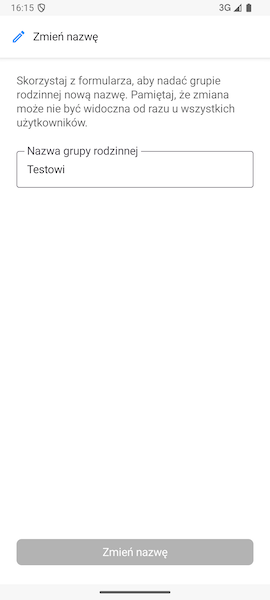
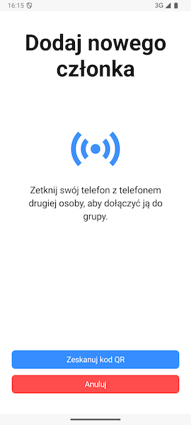
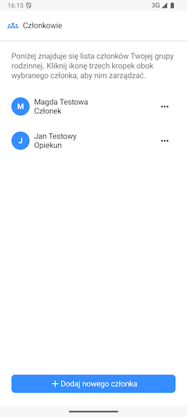
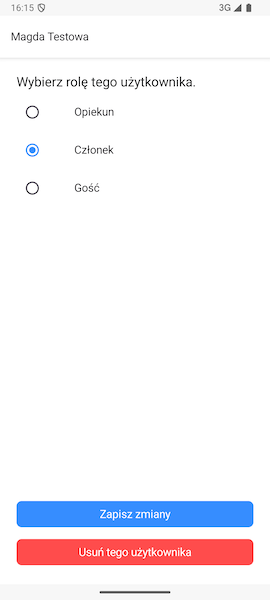

# Zarządzanie grupą rodzinną

> 🔒 **Ważne:** Tylko Opiekun może zarządzać grupą rodzinną.

## Zmiana nazwy grupy rodzinnej

FamilyVault umożliwia zmianę nazwy grupy rodzinnej. Aby tego dokonać skorzystaj z opcji **Zmień nazwę** na ekranie głównym ustawień. 

Po zmianie nazwy na pożądaną kliknij **Zmień nazwę**, aby zapisać operację.

> **Ważne:** Zmiana będzie widoczna dopiero po ponownym uruchomieniu aplikacji.

## Dodawanie nowych członków

Aby dodać nowego członka do grupy rodzinnej możesz użyć opcji **Dodaj nowego członka**. Przejdziesz wówczas do ekranu, gdzie możesz zetknąć swój telefon z telefonem drugiej osoby lub zeskanować kod QR, aby dodać tę osobę do grupy rodzinnej.

### Skanowanie kodu QR

> **Ważne:** Skanowanie kodu QR jest **niezalecaną** metodą dodawania nowego członka. Aby zapewnić sobie pełne bezpieczeństwo oferowane przez FamilyVault w miarę możliwości korzystaj z metody NFC.

Aby dodać członka przy użyciu kodu QR użyj przycisku **Zeskanuj kod QR**. 

> **Ważne:** Jeżeli telefon poprosi Cię o zgodę na użycie kamery - **wyraź ją**. W przeciwnym wypadku nie będzie możliwości skorzystania z tej funkcjonalności.

Skieruj swój telefon na kod, który wygenerowała druga osoba po wybraniu odpowiedniej opcji w swojej aplikacji.

### Dlaczego dołączanie poprzez NFC jest bezpieczniejsze niż przez kod QR?

Dodanie nowej osoby do grupy rodzinnej przy użyciu NFC wymaga fizycznej obecności obu osób w celu zetknięcia swoich telefonów. To gwarantuje, że dodajemy dokładnie tę osobę, którą chcemy oraz dołączamy do dokładnie tej grupy, do której chcemy dołączyć. Dodatkowo uniemożliwia to zrobienia zdjęcia kodu QR przez osoby trzecie.

### Odbiór informacji

Informacje, które tutaj otrzymujemy to identyfikator nowego użytkownika, token dołączający oraz jego nazwa i klucz publiczny. Przesyłamy je na serwer FamilyVault z poleceniem zmiany statusu tokenu na "sukces" oraz załączeniem do niego informacji takimi jak identyfikator grupy rodzinnej.

### Czym jest token dołączający?

Token dołączający jest to informacja, na podstawie której serwer FamilyVault jest w stanie zidentyfikować konkretny proces dołączenia do grupy rodzinnej.

## Modyfikacja oraz usuwanie członków grupy rodzinnej

Aby zmodyfikować rolę lub usunąć członka grupy rodzinnej wybierz opcję **Członkowie** na ekranie głównym ustawień. Zobaczysz wówczas wszystkich członków swojej grupy rodzinnej, a pod ich nazwą użytkownika również ich obecną rolę.

Aby zmodyfikować członka naciśnij ikonę po prawej stronie od ich nazwy. Zobaczysz wówczas ekran, na którym możesz zmienić ich rolę lub usunąć ich z grupy rodzinnej.

> **Ważne:** Aby dowiedzieć się więcej o rolach w naszej aplikacji przejdź do [Objaśnienie ról użytkowników](./user-roles.md)

> **Ważne:** Usunięcie użytkownika nie usunie z grupy rodzinnej danych, które dodał (wątki czatów, zdjęcia i dokumenty w szufladzie oraz zadania i listy zadań).

> **Ważne:** Operacja usunięcia użytkownika jest **nieodwracalna**. Aby ten użytkownik otrzymał na nowo dostęp do grupy rodzinnej będzie musiał założyć nowy profil.