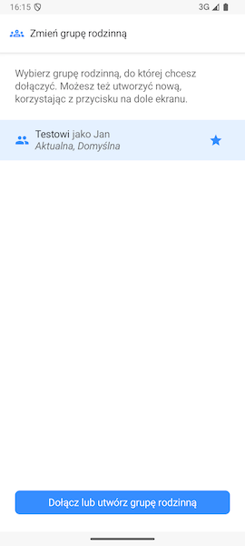

# Przełączanie się między grupami rodzinnymi

FamilyVault umożliwia bycia członkiem w wielu grupach rodzinnych. Przełączanie się między nimi umożliwia specjalne opcje w Ustawieniach.

## Tworzenie lub dołączanie do kolejnej grupy rodzinnej

Na ekranie głównym ustawień znajdziemy opcję **Dołącz lub utwórz grupę rodzinną**. Opcja ta przenosi nas do ekranów, o których jest mowa na stronie [Pierwsze uruchomienie aplikacji](../first_launch/first-launch.md). Po wykonaniu wszystkich operacji informacje o nowej grupie rodzinnej znajdą się na ekranie, o którym mowa w [Zmiana obecnej grupy rodzinnej](#zmiana-obecnej-grupy-rodzinnej).

## Zmiana obecnej grupy rodzinnej

Aby przełączyć się na inną grupę rodzinną wejdź w zakładkę **Zmień grupę rodzinną** z ekranu głównego ustawień. Na tym ekranie znajdziemy listę wszystkich grup rodzinnych, których członkami jesteśmy. Pod jej nazwą znajdują się informacje czy dana grupa rodzinna jest **domyślna** lub **aktualna**. 

> **Ważne:** **Domyślną** grupą rodzinną jest ta grupa, do której logujemy się przy uruchomieniu aplikacji. **Aktualną** grupą rodzinną jest ta grupa, do której jesteśmy obecnie zalogowani. Przycisk **Dodaj lub utwórz grupę rodzinną** przeniesie nas do ekranów, o których jest mowa na stronie [Pierwsze uruchomienie aplikacji](../first_launch/first-launch.md).

Aby zmienić **domyślną** grupę rodzinną wystarczy użyć ikony **gwiazdki** znajdującej się po prawej stronie.

Aby zmienić **aktualną** grupę rodzinną wystarczy kliknąć interesującą nas grupę spośród listy.

