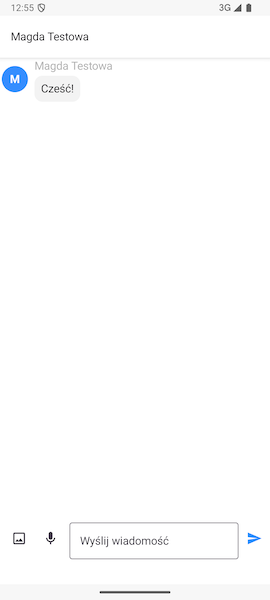

# Ekran czatów

Zakładka czatów jest domyślną zakładką, która pokazuje się po uruchomieniu aplikacji jako członek grupy rodzinnej.

Wątki czatów są podzielone na dwie kategorie - indywidualne oraz grupowe. Przy dołączaniu do grupy rodzinnej, czaty indywidualne są tworzone automatycznie dla każdego członka grupy, dzięki czemu natychmiast możesz napisać do dowolnej osoby w Twojej grupie rodzinnej.

## Ekran wątku czatu

Po naciśnięciu interesującego nas wątku czatu zostaniemy przeniesieni do jego zawartości. 

Możemy tutaj przeczytać wszystkie wiadomości tekstowe, odsłuchać wszystkie wiadomości głosowe oraz zobaczyć wszystkie zdjęcia, które zostały wysłane w tym wątku.
Na dole ekranu znajdują się opcje wysyłania treści:

- ikonka obrazka umożliwia wybór zdjęcia z galerii systemowej, które chcemy wysłać,
- ikonka mikrofonu pozwala nagrać i wysłać wiadomość głosową,
- pole tekstowe służy do wpisania wiadomości tekstowej.

Ikonka po prawej stronie zatwierdza wysłanie wiadomości.