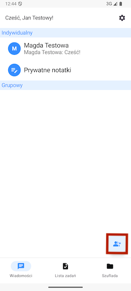
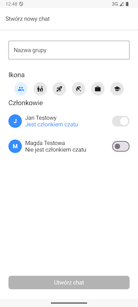
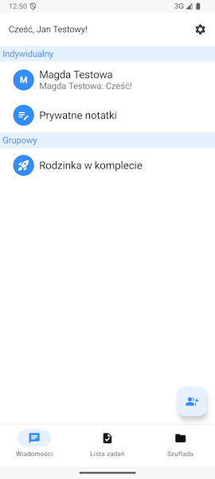
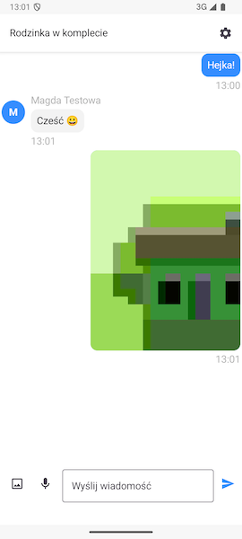
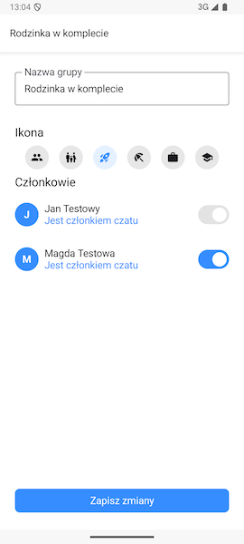

# Wątki grupowe

## Tworzenie wątku grupowego

Aby utworzyć wątek grupowy kliknij zaznaczony poniżej przycisk znajdujący się w prawym dolnym rogu ekranu.

Otworzy się wówczas ekran, na którym wybierzesz nazwę, ikonę oraz członków nowego czatu grupowego:

Po zatwierdzeniu przyciskiem **Utwórz czat grupowy** zostaniemy przeniesieni do głównego ekranu, na którym pojawi się utworzony przez nas własnie czat grupowy.

## Ekran wątku grupowego

Podobnie do wątków indywidualnych, aby wejść do interesującego nas wątku grupowego wystarczy kliknąć na niego na ekranie głównym. Przeniesie nas to do jego zawartości.

Możesz go edytować dzięki ikonie koła zębatego w prawym górnym rogu ekranu.

> 🔒 **Ważne:** Prawo do edycji mają wszyscy członkowie czatu, którzy spełniają **przynajmniej jeden** z poniższych warunków:
> - Mają rolę Opiekuna w grupie rodzinnej
> - Są osobą, która utworzyła ten wątek czatu
> Jeżeli nie widzisz ikony koła zębatego - nie spełniasz żadnego z powyższych warunków i nie możesz edytować tego wątku.

Po kliknięciu w koło zębate zostaniemy przeniesieni do formularza analogicznego do formularza tworzenia czatu grupowego. Możemy tutaj dodać lub usunąć członków czatu, zmienić ikonę wątku oraz jego nazwę.
> 🔒 **Ważne:** Nie możesz usunąć samego siebie z wątku czatu.

