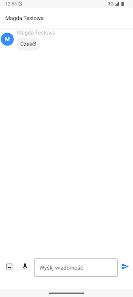

# Wątki indywidualne

## Ekran wątku czatu

Po naciśnięciu interesującego nas wątku czatu zostaniemy przeniesieni do jego zawartości. 

Możemy tutaj przeczytać wszystkie wiadomości tekstowe, odsłuchać wszystkie wiadomości głosowe oraz zobaczyć wszystkie zdjęcia, które zostały wysłane w tym wątku.
Na dole ekranu znajdują się opcje wysyłania treści:

- ikonka obrazka umożliwia wybór zdjęcia z galerii systemowej, które chcemy wysłać,
- ikonka mikrofonu pozwala nagrać i wysłać wiadomość głosową,
- pole tekstowe służy do wpisania wiadomości tekstowej.

Ikonka po prawej stronie zatwierdza wysłanie wiadomości.

### Wysyłanie wiadomości głosowej

Aby wysłać wiadomość głosową naciśnij ikonkę mikrofonu na dole ekranu. Jeżeli telefon poprosi Cię o wyrażenie zgody na używanie mikrofonu przez aplikację musisz ją zaakceptować, aby skorzystać z tej funkcjonalności.

> **Ważne:** Korzystamy z mikrofonu Twojego telefonu tylko **w trakcie** nagrywania wiadomości głosowej.

Aby anulować wysłanie wiadomości użyj ikony **kosza** po lewej stronie ekranu.

Aby wysłać wiadomość użyj ikony **po prawej stronie**.

### Odsłuchiwanie wiadomości głosowej

Gdy członek wątku czatu, w którym jesteś wyśle wiadomość głosową pojawi się charakterystyczna wiadomość w postaci symbolu spektrum dźwięku oraz ikony **odtwarzania**. Aby odsłuchać wiadomość kliknij ją. Gdy odtwarzanie się rozpocznie, ikona **odtwarzania** zostanie zastąpiona przez ikonę **pauzy**. Użyj jej jeśli chcesz zatrzymać odtwarzanie przed zakończeniem wiadomości.

### Wysyłanie zdjęć

Aby wysłać zdjęcie na swój wątek czatu naciśnij ikonkę obrazka. Otworzy się wówczas galeria Twojego telefonu.

> **Ważne:** Jeżeli Twój telefon poprosi o zgodę na dostęp do galerii przez FamilyVault musisz ją wyrazić, aby skorzystać z tej funkcjonalności.