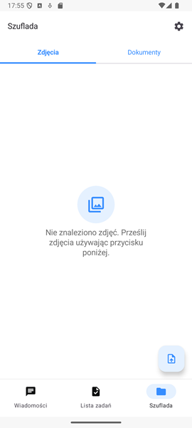
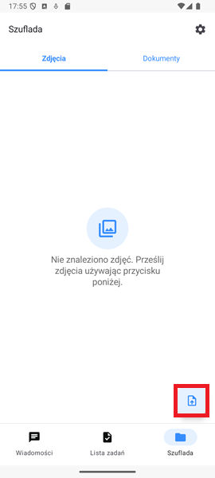
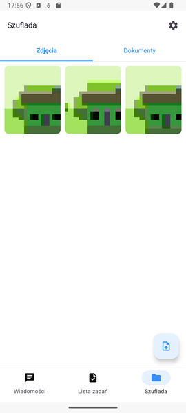

# Szuflada

Szuflada jest bezpiecznym schowkiem na zdjęcia oraz dokumenty Twojej grupy rodzinnej. To idealne miejsce na przechowanie cennych momentów jak różne dowody zakupu, umowy oraz dokumenty urzędowe, a także zdjęcia z wakacji.

>  **Ważne:** Dostęp do zawartości Szuflady mają **wyłącznie** Członkowie oraz Opiekunowie grupy rodzinnej.

## Zdjęcia

Wchodząc pierwszy raz na ekran szuflady przywita nas informacja, o tym że jest pusta.

Aby dodać do niej zdjęcia należy użyć przycisku znajdującego się w prawym dolnym rogu ekranu.

>  **Ważne:** Jeżeli Twój telefon poprosi o zgodę na dostęp do galerii przez FamilyVault musisz ją wyrazić, aby skorzystać z tej funkcjonalności.

Po poprawnym wysłaniu zdjęć na serwer pojawią się one w szufladzie

