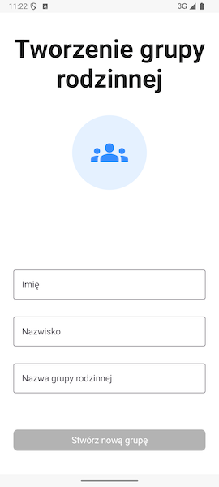

# Tworzenie grupy rodzinnej

Po wybraniu opcji **Utwórz grupę rodzinną** zobaczysz pierwszą część formularza, dzięki któremu założysz swoją grupę rodzinną.

Wpisz tutaj swoje imię lub nazwę użytkownika oraz nazwę nowej grupy rodzinnej. Opcjonalnie możesz również dodać swoje nazwisko.
W razie jakichkolwiek niepoprawnych danych informacja o tym co poszło nie tak znajdzie się pod polem, którego błąd dotyczy.

Po wypełnieniu wszystkich informacji naciśnij **Dalej**.

## Ustawianie hasła klucza prywatnego

Następny ekran poprosi Cię o podanie hasła zabezpieczającego Twój **klucz prywatny** w aplikacji FamilyVault.

### Dlaczego ustawienie silnego hasła do klucza prywatnego jest ważne?

**Klucz prywatny** to element, który służy do szyfrowania i odszyfrowywania Twoich danych rodzinnych (np. zdjęć, dokumentów, wiadomości). Hasło, które tu ustawiasz, **nigdy nie jest wysyłane na serwer** — pozostaje wyłącznie na Twoim urządzeniu.

> **Ważne:** Nie zapomnij tego hasła! Nie będziemy w stanie go odzyskać. Jeśli je stracisz, dostęp do zaszyfrowanych danych będzie niemożliwy.

Zalecamy użycie:
- Minimum 8 znaków,
- Małych i wielkich liter,
- Cyfr oraz znaków specjalnych.

Wpisz dwukrotnie hasło oraz kliknij **Dalej**. Po chwili znajdziesz się na ekranie głównym aplikacji **FamilyVault**!

