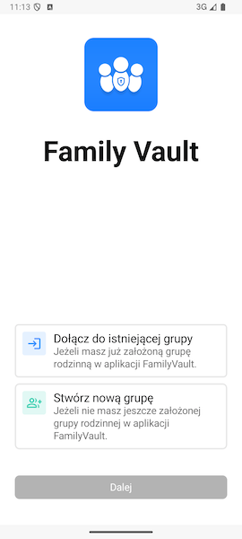

# Pierwsze uruchomienie aplikacji

Ta sekcja wytłumaczy Twoje pierwsze kroki w FamilyVault, czyli jak założyć lub dołączyć do grupy rodzinnej.

## Wybór sposobu połączenia z serwerem

Po uruchomieniu aplikacji po raz pierwszy przywita Cię ekran wyboru sposobu połączenia z serwerem.

Jeśli nie masz wiedzy technicznej wybierz **rozwiązanie chmurowe** - nie wymaga ono żadnej konfiguracji nadal oferując pełne bezpieczeństwo Twoich danych.

Jeżeli posiadasz wiedzę techniczną i chciałbyś skorzystać z własnego serwera, musisz takowy najpierw przygotować. Szczegółowe instrukcje na ten temat znajdziesz na stronie [Samodzielna konfiguracja PrivMX Bridge](../self_hosting/self-hosting-intro.md). Po przygotowaniu konfiguracji wybierz opcję **PrivMX Bridge**.

Po zaznaczeniu odpowiedniej opcji kliknij przycisk **Dalej** znajdujący się u dołu ekranu.

## Załóż lub dołącz do grupy rodzinnej

Po zaakceptowaniu wstępnych ekranów powitalnych aplikacja poprosi Cię o określenie, czy chcesz dołączyć do istniejącej grupy rodzinnej, czy utworzyć nową.

Po dokonaniu wyboru naciśnij przycisk Dalej, aby kontynuować konfigurację.

Informacje o **tworzeniu grupy rodzinnej** znajdziesz na stronie [Tworzenie grupy rodzinnej](./create-family-group.md).

Informacje o **dołączaniu do grupy rodzinnej** znajdziesz na stronie [Dołączanie do grupy rodzinnej](./join-family-group.md).