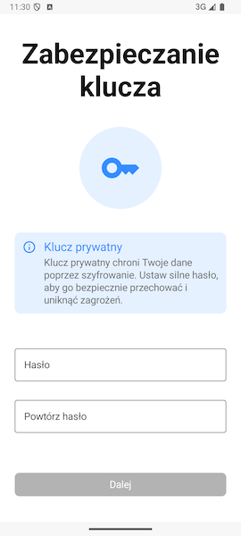
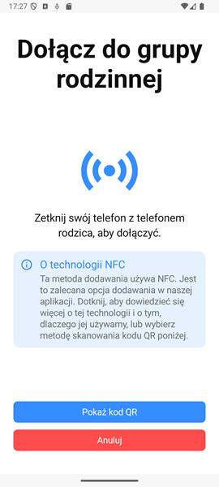
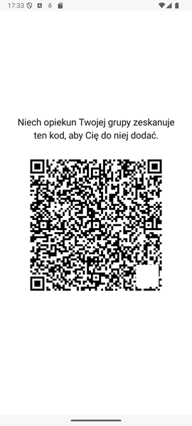

# Dołączanie do grupy rodzinnej 

Po wybraniu opcji **Dołącz do istniejącej grupy** zobaczysz pierwszą część formularza, dzięki któremu dołączysz do grupy rodzinną.

Wpisz tutaj swoje imię lub nazwę użytkownika, opcjonalnie możesz również dodać swoje nazwisko.
W razie jakichkolwiek niepoprawnych danych informacja o tym co poszło nie tak znajdzie się pod polem, którego błąd dotyczy.

Po wypełnieniu wszystkich informacji naciśnij **Dalej**.

## Ustawianie hasła klucza prywatnego

Następny ekran poprosi Cię o podanie hasła zabezpieczającego Twój **klucz prywatny** w aplikacji FamilyVault.

### Dlaczego ustawienie silnego hasła do klucza prywatnego jest ważne?

**Klucz prywatny** to element, który służy do szyfrowania i odszyfrowywania Twoich danych rodzinnych (np. zdjęć, dokumentów, wiadomości). Hasło, które tu ustawiasz, **nigdy nie jest wysyłane na serwer** — pozostaje wyłącznie na Twoim urządzeniu.

>  **Ważne:** Nie zapomnij tego hasła! Nie będziemy w stanie go odzyskać. Jeśli je stracisz, dostęp do zaszyfrowanych danych będzie niemożliwy.

Zalecamy użycie:
- Minimum 8 znaków,
- Małych i wielkich liter,
- Cyfr oraz znaków specjalnych.

Po dwukrotnym wpisaniu hasła naciśnij **Dalej**.

## Dołączanie do grupy rodzinnej - NFC i kod QR

Na tym ekranie musisz zetknąć swój telefon z telefonem drugiej osoby, aby móc dołączyć do jej grupy rodzinnej. Wykorzystywana jest tutaj technologia NFC do przesyłu informacji pomiędzy urządzeniami. **Jest to zalecana przez nas metoda dołączania do grupy rodzinnej, gwarantująca najwyższe bezpieczeństwo.** Dane, które są przesyłane obejmują identyfikator użytkownika, token dołączający, jego nazwę oraz klucz publiczny. 

Alternatywnie kliknij przycisk **Pokaż kod QR**, aby wygenerować kod, który po zeskanowaniu również doda Cię do grupy rodzinnej.

### Czym jest token dołączający?

Token dołączający jest to informacja, na podstawie której serwer FamilyVault jest w stanie zidentyfikować konkretny proces dołączenia do grupy rodzinnej. Po zetknięciu telefonów, lub zeskanowaniu kodu QR nasza aplikacja wysyła zapytania do niego legitymując się tym tokenem. Serwer w odpowiedzi przesyła status dołączenia (oczekujący, sukces, błąd) oraz (jeśli status to sukces) dane potrzebne do podłączenia się pod pożądaną grupę rodzinną.

### Dlaczego dołączanie poprzez NFC jest bezpieczniejsze niż przez kod QR?

Dołączenie do grupy rodzinnej przy użyciu NFC wymaga fizycznej obecności obu osób w celu zetknięcia swoich telefonów. To gwarantuje, że dodajemy dokładnie tę osobę, którą chcemy oraz dołączamy do dokładnie tej grupy, do której chcemy dołączyć. Dodatkowo uniemożliwia to zrobienia zdjęcia kodu QR przez osoby trzecie.

