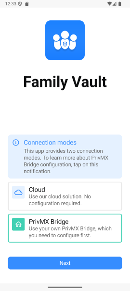
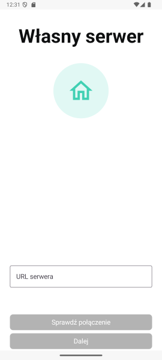
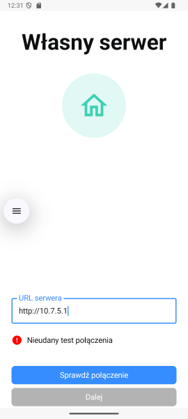
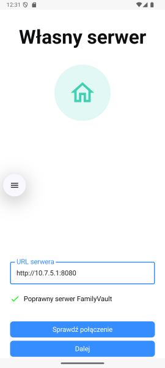
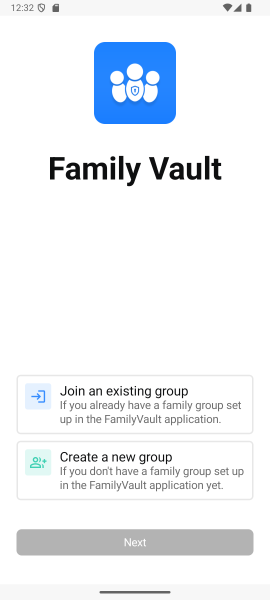

# Łączenie do własnego serwera FamilyVault z poziomu aplikacji

Aby połączyć aplikację FamilyVault z własnym serwerem skorzystaj z poniższych wskazówek.

  
**Ekran początkowy** – wybierz tutaj opcję `PrivMX Bridge`, aby rozpocząć proces łączenia aplikacji z własną instancją serwera FamilyVault.

  
**Formularz połączenia** – podaj tutaj adres URL serwera, do którego chcesz się połączyć. Po wpisaniu go, naciśnij **Sprawdź Połączenie** aby przeprowadzić test połączenia.

> **Ważne:** Zwróć uwagę, czy używa on protokołu `http` czy `https`. Podanie nieprawidłowego przedrostka może skutkować błędem połączenia.

  
**Błąd połączenia** – informacja ta oznacza, iż test połączenia z serwerem FamilyVault nie powiódł się. Upewnij się, że serwer działa oraz podano prawidłowy adres URL.

  
**Połączenie udane** – aplikacja poprawnie nawiązała połączenie z serwerem. Po przejściu dalej możesz kontynuować tworzenie nowej grupy rodzinnej, lub dołączenie do już istniejącej.

  
**Widok po połączeniu** – aplikacja działa już w trybie self-hostingu. Dane będą przechowywane i przetwarzane wyłącznie na skonfigurowanym serwerze. \
**Następne kroki objaśnione są w sekcji [Pierwsze uruchomienie aplikacji / Załóż lub dołącz do grupy rodzinnej ](../first_launch/first-launch.md/#załóż-lub-dołącz-do-grupy-rodzinnej).**
