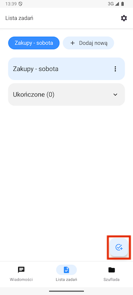
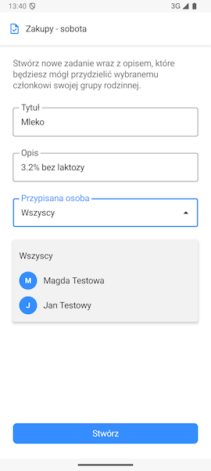
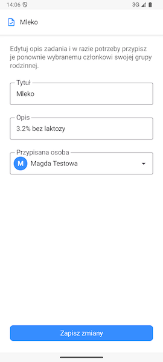

# Tworzenie i zarządzanie zadaniami

## Dodawanie nowego zadania

Aby dodać nowe zadanie użyj przycisku w prawym dolnym rogu ekranu.

> 🔒 **Ważne:** Każdy członek grupy rodzinnej może dodać nowe zadanie.

Przycisk ten przeniesie nas do formularza tworzenia nowego zadania. Musimy tutaj określić nazwę zadania oraz opcjonalnie jego opis oraz opcjonalnie przypisać do niego jednego z członków grupy. Domyślnie przypisani są **wszyscy**.

Po utworzeniu nowego zadania pojawi się ono na liście. Jeśli została przypisana konkretna osoba pojawi się również jej awatar. 

Kratka po lewej strony służy do oznaczenia ukończonego zadania. Po oznaczeniu zostanie przeniesione do specjalnej kategorii **Ukończone**.

Kliknięcie na nazwę lub opis zadania przeniesie nas do ekranu edycji zadania.

