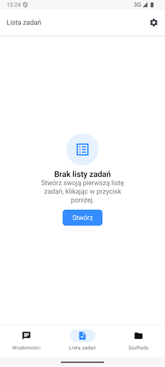
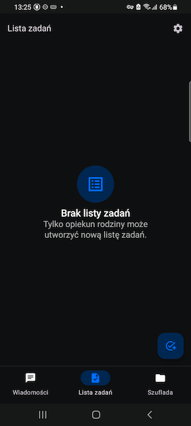
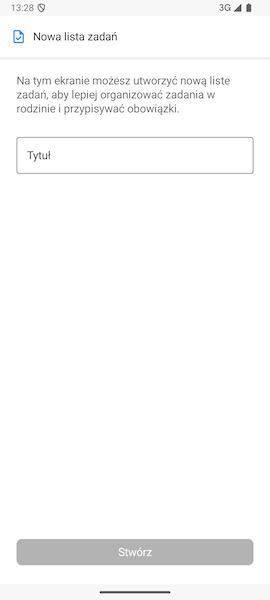
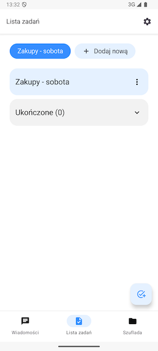
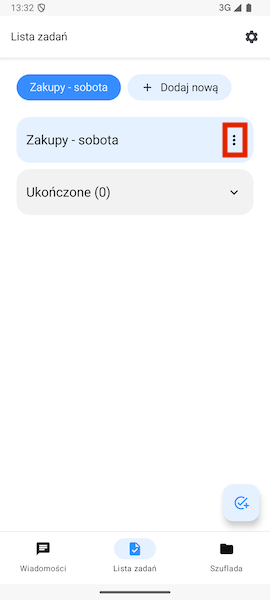
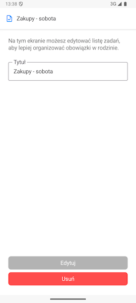
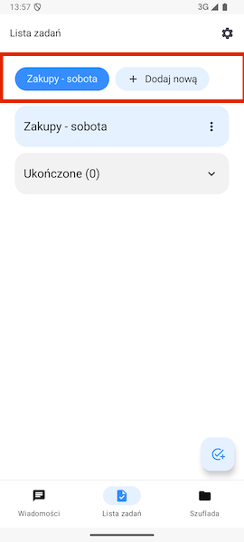

# Lista zadań

Listy zadań mogą pomóc w organizacji zadań w Twojej grupie rodzinnej. Możesz rozdzielić zadania wśród jej członków oraz łatwo oznaczyć, które zadania są już wykonane.

## Pierwsze wejście do zakładki Lista zadań

Po wejściu do zakładki Listy zadań po raz pierwszy otrzymamy informację, że lista zadań jest pusta. W zależności od naszej roli w grupie rodzinnej, komunikat na tym ekranie będzie się różnił.

**Jeżeli jesteśmy opiekunem** w tej grupie rodzinnej, otrzymamy możliwość utworzenia nowej listy zadań.

**Jeżeli jesteśmy gościem, lub członkiem** opcja ta jest niedostępna.

## Tworzenie nowej listy zadań

> **Ważne:** Tylko Opiekunowie grupy rodzinnej mogą utworzyć listę zadań.

Po wybraniu opcji **Stwórz** zostaniemy przeniesieni do formularza tworzenia nowej listy zadań. Po wypełnieniu pola **Tytuł** możemy kontynuować przyciskiem **Stwórz** u dołu ekranu.

Po utworzeniu zostaniemy przywróceni na poprzedni ekran, gdzie przywita nas utworzona lista. Możemy tutaj zauważyć podział kategorię o nazwie naszej listy zadań oraz **Ukończone**.

## Edycja listy zadań

Po utworzeniu listy zadań możemy ją edytować lub usunąć. Aby wejść do ekranu edycji wystarczy użyć ikony **Więcej** po prawej stronie ekranu.

> **Ważne:** Edytować listę zadań mogą tylko Opiekunowie grupy rodzinnej.

Zostaniemy przeniesieni do ekranu edycji listy zadań. Możemy tam zmienić jej nazwę, a także usunąć ją używając przycisku na dole ekranu.

## Dodawanie kolejnych list zadań

Na górze ekranu znajdują się wszystkie listy zadań utworzone w Twojej grupie rodzinnej. Ostatnią opcją jest przycisk **Dodaj nową**. Kliknięcie go przenosi nas do formularza tworzenia nowej listy zadań. Aby zmienić obecną listę zadań wystarczy kliknąć na przycisk z jej nazwą.

